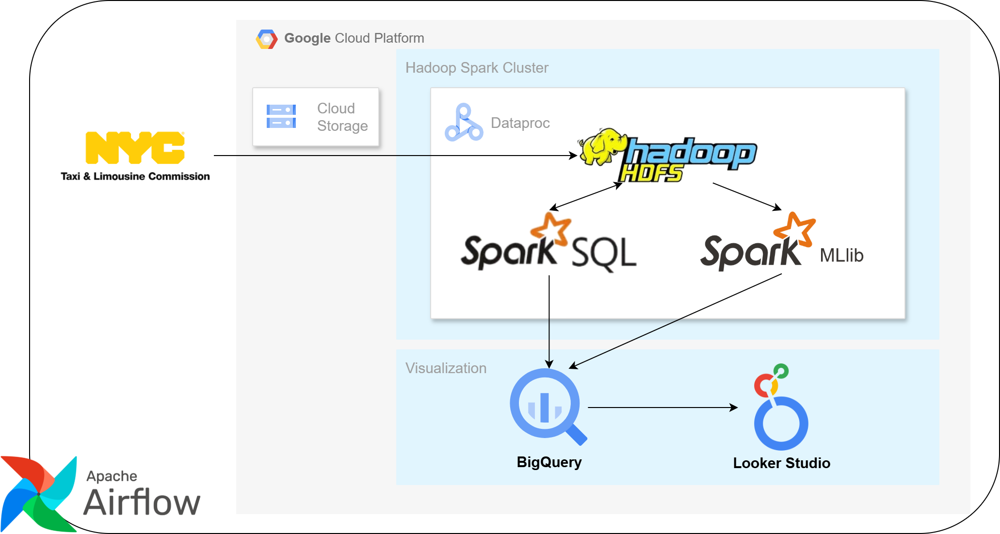

# TLC Trip Record Data Processing with Google Cloud Platform

## Introduction

This project focuses on the batch processing and analysis of New York TLC (Taxi & Limousine Commission) Trip Record Data using Big Data technologies from Google Cloud Platform. It aims to provide deep insights and timely information on public transportation usage trends as well as factors affecting travel costs in New York.

## Technologies Used

- Google Cloud Storage: Intermediate storage for storing raw data sent from local
- Google Dataproc: Managed service for running Apache Spark, Apache Hadoop
    - Spark SQL: For data processing and analysis
    - Spark MLlib: For machine learning tasks
    - Hadoop HDFS: Data Warehouse Storage
- Google BigQuery & Looker Studio: For visualization
- Apache Airflor: For workflow orchestration

## System Architecture

The system uses batch processing for comprehansice data analysis

Dataproc cluter architecture

## Data Warehouse Schema

## Project Structure

- `gcs`
  - `bucket.py` - function to create bucket on Google Cloud Storage
  - `load_data.py` - functions to download data and upload to bucket on GCS
  - `main.py` - execution file

- `dataproc`
  - `cluster.py` - functions to manage dataproc cluster (create, update, delete, start, stop, submit job)
  - `jobs` & `notebooks` - contains PySpark jobs and notebooks for processing data
  - `main.py` - execution file

- `docs` - files for README.md
- `setup_test.py` - check authen from local to GCP
- `serviceKeyGoogle.json` - Service Account key for authentication

## Project Infomation

- Project ID: `uber-analysis-439804`
- Region: `us-central1`
- Dataproc's Cluster Name: `uber-hadoop-spark-cluster`
- Bucket's Name:
  - Raw data: `uber-{year}-154055`
  - PySpark jobs and tmp dir: `uber-pyspark-jobs`

## Installation and Setup

### Prerequisite
- Account with Google Cloud Platform, Billing enabled

### Setup GCP Python API
- Create service Account with owner role. Go to manage keys and create `serviceKeyGoogle.json` key, store in this directory  (put in .gitignore)
- Enable APIs
  - Compute Engine API
  - Cloud Dataproc API
  - Cloud Resource Manager API
- Set up virtual environment

        py -m venv env
        ./env/Scripts/activate

- Install Python libraries

        pip install -r requirements.txt

- Test run

        py setup_test.py
