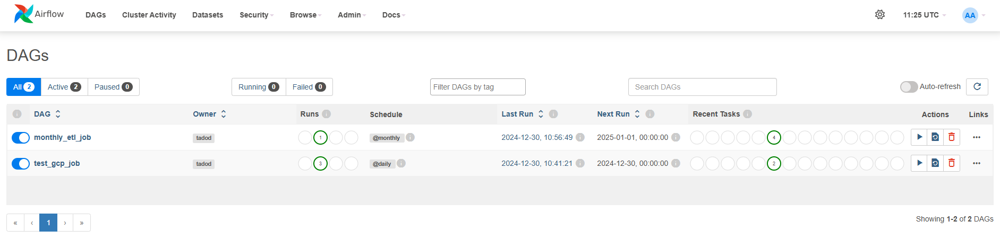

# Airflow Quick Setup

Create mounted directories

    # -p stands for par parents and allows us to create parent folder if it does not exist
    mkdir -p ./dags ./logs ./plugins

Build docker image

    # Build the image in the Dockerfile and name it gcp_airflow and version it as latest
    docker build . --tag gcp_airflow:latest

Make sure to store your `serviceKeyGoogle.json` in `credentials` directory

Spin the Container

    docker compose up -d

- Username: `airflow`
- Password: `airflow`
- Webserver: `localhost:8081`

